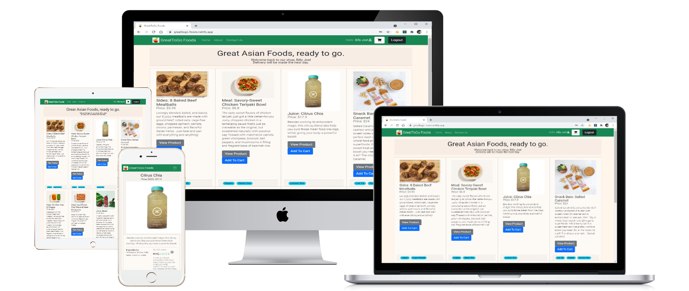
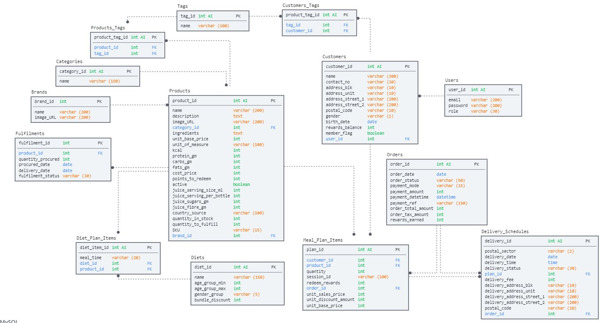

# GreatToGo Foods eCommerce Shop - Front-end
This is the public Front-end web app for the GreatToGo Foods eShop, a home-based business with a small range of products. An education-purpose project on Full-Stack Web Development (Project 3) for TGC Singapore.  Main technologies: NodeJS/Express Framework, React (Hooks method)

Frontend Website: https://greattogo-foods.netlify.app/
Test accounts for Customer (email/password):
1. billie.joel@mail.com / rotiprata
2. marilyn@mail.com / rotiprata

Backend Website: https://hh-tgc12p3-greattogo.herokuapp.com/
Test accounts for Backend Users:
1. Administrator: john.doe@mail.com / rotiprata
2. Business: ali.mat@mail.com / metallica

Backend documentation can be found at Github repo: https://github.com/haryati75/TGC12-P3-GreatToGoFoods-BE

The below shows sample of the eCommerce shop front-end:


## Target Customers:  
A meal-delivery site targeting health-conscious foodies in Singapore to buy ready-to-eat meals, snacks and beverages. 

## Strategy:
Although stocks can be low, Customers are still allowed to make orders and payments while the Business owner fulfils its orders backend.  This is usually suitable for small home-based businesses that has smaller range of products and can make faster turnarounds due to low volume of orders.

## Objectives:
The website allows Customers to perform the following functions:
1. View Products from listing 
2. View a specific Product with Ingredients, Brands, etc
2. Register as a Customer to shop
3. Login/logout as a Customer
3. Reset and Change Password
4. Add to Cart and Shopping Cart changes (quantity, delivery address)
    * Allow to Add to Cart even when Low Stock
5. Checkout and Pay (via Stripe)
    * If Stripe Payment is cancelled (by on GoBack at Stripe), the Cart Items is still available to repeat Checkout 
6. Check Order statuses and view Previous Orders
7. View and Update Customer account, profile 
8. Email to GreatToGo Admin via the Contact Us

## Business Potential
As the business grow, the products can be package as meal plans for recurring delivery scheduled. Loyalty programs can be introduced to provide discounts to Members. Tailoring of diets such as for moms on confinement can be a potential opportunities for growing the customer segments. 

An initial Logical Schema was earlier designed for such growth:


The final logical schema can be found at the Backend documentation (see Github link at the top).

## Front-end Technologies:
The following highlights the technologies used for the platform development at front-end:
* React 
* REST API, webhooks

## Third-parties API Webhooks:
* Stripe - payment services
* EmailJS - email services
* axios - API

## React Hooks, Router-DOM, Context API
* useEffect, useState
* useContext via Providers (User, Product)
* Router, Switch, Route, Link
* useHistory, useLocation

## Third-parties UI
* react-bootstrap
* momentjs, react-datepicker
* Fontawesome
* Google Fonts

## Development environment:
* Gitpod Workspace (npx create-react-app)
* Github repository

## Backend Databases: 
1. MySQL for Development in Gitpod 
2. Postgres for Deployment at Heroku

## Full-Stack Web Development Framework
The full-stack framework architecture adopted for this project is depicted as follows:


The development strives to align to the above framework during coding. However, due to the limited duration for the project, more refactoring and design patterns could have been implemented into the codes.

Backend documentation can be found at Github repo: https://github.com/haryati75/TGC12-P3-GreatToGoFoods-BE

## Dependencies:
```
    "@testing-library/jest-dom": "^5.11.4",
    "@testing-library/react": "^11.1.0",
    "@testing-library/user-event": "^12.1.10",
    "axios": "^0.21.1",
    "bootstrap": "^5.0.2",
    "emailjs-com": "^3.2.0",
    "moment": "^2.29.1",
    "react": "^17.0.2",
    "react-bootstrap": "^1.6.1",
    "react-bootstrap-floating-label": "^1.6.0",
    "react-datepicker": "^4.1.1",
    "react-dom": "^17.0.2",
    "react-moment": "^1.1.1",
    "react-router-dom": "^5.2.0",
    "react-scripts": "4.0.3",
    "web-vitals": "^1.0.1"
```

## Testing
Test account for customer:
1. billie.joel@mail.com
2. marilyn@mail.com

### **_Scenario 1_**: Add to Cart from Product Listing for logged in Customer, and perform Checkout and Payment in Stripe
##### Test Steps:
Login as Customer User (billie.joel@mail.com/rotiprata)
1. Go to main page for list of Products
2. Add to Cart a selected Product (repeat for another 2 products)
3. Click on the Shopping Cart icon
4. Click on the (+/-) buttons
5. Click Remove to remove a Product from the Cart
6. Click on Checkout button
7. At Stripe, 
    * key in Credit Card: 4242 4242 4242 4242
    * key in expiry date and CVV: 12/21 and 123
    * key in Name: Billy
    * Click on Pay button
8. Review Receipt Page
9. Click on "Billie Joel" name at the top right of the Menu to goto Billy's Profile.
10. Click on View Order History button

##### _Expected Result_: 
1. When product is added to Cart, message "Product added successfully to Cart" at the top of screen.
2. When Shopping Cart is clicked, shows a list of Products that have been added.
3. When Quantity is adjusted, the Amount and Total is reflected correctly.
4. When Remove is clicked, product is removed from the Cart.
5. When Checkout is clicked, redirect to Stripe Payment page.
6. At Stripe, when Pay is clicked, redirect back to GreatToGo site and show Receipt Success page.
7. At Billy's Profile and View Order History is clicked, list of Orders with the latest payment on top. Order Details must be the same as in Stripe. Order Status and Payment Status must be "Paid".

## Deployment
The deployment is done at Netlify under the free plan.

The build and deploy is using the **Continuous Deployment from a Git Repository", which automatically deploys to production upon any commit changes at the Github repository.

## Credits
Photos and Content of Products are sourced from the following websites:
https://perfectsnacks.com/
https://www.freshly.com/plans-and-menu
https://www.hicjuice.com/

### Project is sponsored by: 
Trent Global College, Singapore
under its Software Development Bootcamp program

Developed by: Haryati Hassan, TGC Batch 12
August 2021
